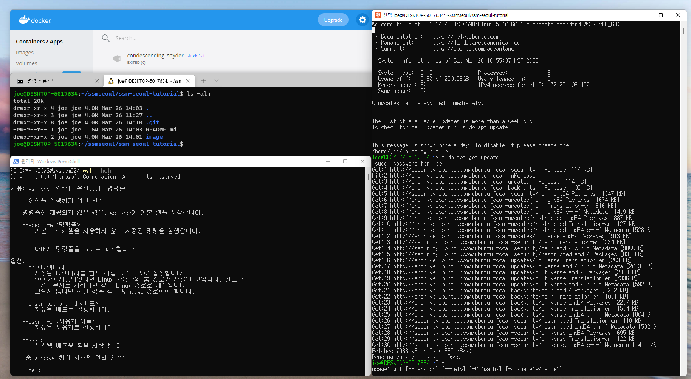

# SSM 2-02 Practical Issues in Data Engineering

Swiss School of Management / AI·Big Data DBA 2학기 두 번째 강의 기록

## 개발환경 세팅
### 설치 순서
1. WSL 2(Windows Subsystem for Linux 2)
2. Ubuntu 20.04 LTS
3. Windows Terminal
4. Git
5. Docker Desktop
6. Github ssm-seoul-tutorial repo

### 설치 완료 스크린샷

## 수업 내용 요약
### 강의 계획

|일차|내용|실습|
|:-----:|:-----|:-----|
|1|하둡 시스템 역사와 저장 및 처리 시스템 이해, 하둡 생태계 도구 및 역할|로컬 환경 및 Github 저장소 구성|
|2|데이터 ETL 및 서비스 구성 유의사항, ETL 컴포넌트 내부 구조와 동작 방식|아파치 스파크 ETL|
|3|데이터 웨어하우스, 레이크 차이 이해, 데이터 레이크 구축 준비사항, 다양한 데이터 아키텍처|도커 컨테이너 이미지 생성/배포/실행|

- 이론 70% / 실습 30%

### 참고문헌
> 1. 엔터프라이즈 데이터 플랫폼 구축
> 2. 엔터프라이즈 빅 데이터 레이크
> 3. 빅데이터를 지탱하는 기술
> 4. 스파크 완벽 가이드
> 5. 하둡 완벽 가이드
> 6. 데이터 웨어하우스 멘토
> 7. 빅데이터 - 네이선 마츠
> 8. 대용량 아키텍처와 성능 튜닝
> 9. 실무로 배우는 빅데이터 기술
> 10. 엔터프라이즈 데이터 레이크 구축

### 데이터 엔지니어링 소개
* '빅데이터를 지탱하는 기술' 책에서 인상깊었던 구절
  - 데이터 엔지니어링은,
    > 데이터 처리를 어떻게 시스템화하는가에 대한 문제  
    > '데이터 준비'라는 엔지니어링 부분을 효율화하지 않으면 데이터 분석의 수고가 사라지는 일은 없다.  

